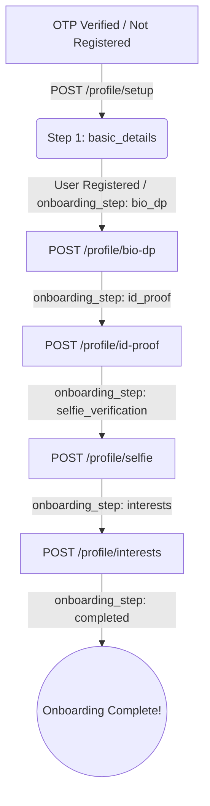

# Dating & Matrimony Mobile App API Documentation

This documentation covers the Authentication and Profile Onboarding flow for the mobile application.

---

## 🔑 Authentication & Headers

For all authenticated endpoints, you must include the Sanctum bearer token in the headers:
```http
Authorization: Bearer <your_token_here>
Accept: application/json
```

---

## 📈 Onboarding Steps & Progression

The user proceeds through a 5-step setup flow. The API returns an `onboarding_step` parameter in the user object to help you determine which screen to show next.



---

## 📌 Endpoint Reference

### 1. Send OTP
Request a 6-digit OTP code to be sent to an email or phone number.
* **URL:** `POST /api/v1/auth/otp/send`
* **Content-Type:** `application/json`
* **Body Parameters:**
  | Field | Type | Required | Description |
  | :--- | :--- | :--- | :--- |
  | `type` | `string` | Yes | Must be either `"email"` or `"phone"`. |
  | `value` | `string` | Yes | The email address or phone number (e.g. `+1234567890`). |

* **Response (Success - 200 OK):**
  ```json
  {
    "success": true,
    "message": "OTP code sent successfully."
  }
  ```
* **Response (Error/Rate Limited - 422 Unprocessable Content):**
  ```json
  {
    "success": false,
    "message": "Please wait 45 seconds before requesting a new OTP."
  }
  ```

---

### 2. Verify OTP
Verify the OTP code sent to the email/phone.
* **URL:** `POST /api/v1/auth/otp/login`
* **Content-Type:** `application/json`
* **Body Parameters:**
  | Field | Type | Required | Description |
  | :--- | :--- | :--- | :--- |
  | `type` | `string` | Yes | Must be either `"email"` or `"phone"`. |
  | `value` | `string` | Yes | The email address or phone number verified. |
  | `code` | `string` | Yes | The 6-digit OTP code received (use `"123456"` for local dev testing). |

* **Response (Scenario A: User exists - Logged In - 200 OK):**
  Save the token and navigate to the main screen if `onboarding_step` is `"completed"`. Otherwise, navigate to the next incomplete onboarding step.
  ```json
  {
    "success": true,
    "message": "Login successful.",
    "data": {
      "is_registered": true,
      "token": "1|laravel_sanctum_token...",
      "user": {
        "id": 5,
        "profile_id": "DM-554312",
        "first_name": "John",
        "last_name": "Doe",
        "email": "john@example.com",
        "phone": "+1234567890",
        "gender": "Male",
        "onboarding_step": "completed"
      }
    }
  }
  ```
* **Response (Scenario B: New User - Needs Registration - 200 OK):**
  Navigate to **Step 1: Basic Details Registration**.
  ```json
  {
    "success": true,
    "message": "OTP verified. Complete registration to continue.",
    "data": {
      "is_registered": false,
      "type": "email",
      "value": "newuser@example.com"
    }
  }
  ```

---

### 3. Step 1: Basic Details Registration
Register a new user account. Successful response yields an auth token.
* **URL:** `POST /api/v1/auth/profile/setup`
* **Content-Type:** `application/json`
* **Body Parameters:**
  | Field | Type | Required | Description |
  | :--- | :--- | :--- | :--- |
  | `type` | `string` | Yes | `"email"` or `"phone"`. |
  | `value` | `string` | Yes | Must match the email/phone used to verify OTP. |
  | `first_name` | `string` | Yes | First name of the user. |
  | `last_name` | `string` | No | Last name of the user. |
  | `email` | `string` | Yes | Unique email address. |
  | `phone` | `string` | Yes | Unique phone number in format `+1234567890`. |
  | `gender` | `string` | Yes | Must be `"Male"` or `"Female"`. |
  | `marital_status`| `string` | No | `"Never Married"`, `"Divorced"`, `"Widowed"`, or `"Awaiting Divorce"`. |
  | `dob` | `string` | Yes | Date of birth in format `YYYY-MM-DD`. Must be past/present. |
  | `password` | `string` | No | Minimum 8 characters. |

* **Response (Success - 201 Created):**
  Store the token. The user is now logged in and current step is `bio_dp`.
  ```json
  {
    "success": true,
    "message": "Profile setup completed and registered successfully.",
    "data": {
      "token": "2|laravel_sanctum_token...",
      "user": {
        "id": 6,
        "profile_id": "DM-109283",
        "first_name": "Jane",
        "last_name": "Smith",
        "email": "jane@example.com",
        "phone": "+12345678903",
        "gender": "Female",
        "dob": "1996-08-20",
        "onboarding_step": "bio_dp"
      }
    }
  }
  ```

---

### 4. Step 2: Bio & Profile Picture (DP)
Update the bio information and upload a profile picture.
* **URL:** `POST /api/v1/auth/profile/bio-dp`
* **Method:** `POST`
* **Content-Type:** `multipart/form-data`
* **Headers:** `Authorization: Bearer <token>`
* **Form Parameters:**
  | Field | Type | Required | Description |
  | :--- | :--- | :--- | :--- |
  | `about_me` | `string` | Yes | Minimum 10 characters, max 1000. |
  | `profile_image` | `file` | Yes | Image file (jpeg, png, jpg, webp), max 5MB. |

* **Response (Success - 200 OK):**
  ```json
  {
    "success": true,
    "message": "Bio and profile picture uploaded successfully.",
    "data": {
      "id": 6,
      "first_name": "Jane",
      "profile_image": "http://127.0.0.1:8000/storage/profiles/abcdef.jpg",
      "onboarding_step": "id_proof",
      "about_me": "This is my long bio for the matrimony dating application setup."
    }
  }
  ```

---

### 5. Step 3: ID Proof Upload
Upload a government-issued identification document.
* **URL:** `POST /api/v1/auth/profile/id-proof`
* **Method:** `POST`
* **Content-Type:** `multipart/form-data`
* **Headers:** `Authorization: Bearer <token>`
* **Form Parameters:**
  | Field | Type | Required | Description |
  | :--- | :--- | :--- | :--- |
  | `id_type` | `string` | Yes | Must be: `"Passport"`, `"Aadhaar"`, `"Driving License"`, `"Voter ID"`, `"National ID"`. |
  | `id_document` | `file` | Yes | Image or PDF file (jpeg, png, jpg, pdf), max 10MB. |

* **Response (Success - 200 OK):**
  ```json
  {
    "success": true,
    "message": "ID proof uploaded successfully.",
    "data": {
      "id": 6,
      "onboarding_step": "selfie_verification"
    }
  }
  ```

---

### 6. Step 4: Selfie Verification
Upload a clear selfie image for photo identity verification.
* **URL:** `POST /api/v1/auth/profile/selfie`
* **Method:** `POST`
* **Content-Type:** `multipart/form-data`
* **Headers:** `Authorization: Bearer <token>`
* **Form Parameters:**
  | Field | Type | Required | Description |
  | :--- | :--- | :--- | :--- |
  | `selfie_image` | `file` | Yes | Image file (jpeg, png, jpg, webp), max 5MB. |

* **Response (Success - 200 OK):**
  ```json
  {
    "success": true,
    "message": "Selfie uploaded successfully for verification.",
    "data": {
      "id": 6,
      "onboarding_step": "interests"
    }
  }
  ```

---

### 7. Step 5 (Part A): Get Interest Options List
Fetch all selectable interests options from the master database (categorized). Can be retrieved via either the authenticated or the new public endpoint.

* **Endpoints:**
  - **Authenticated:** `GET /api/v1/auth/profile/interests/options` (Requires `Authorization: Bearer <token>`)
  - **Public:** `GET /api/v1/interests` (Accessible without authentication)

* **Response (Success - 200 OK):**
  ```json
  {
    "success": true,
    "data": [
      {
        "category": "Creativity",
        "options": [
          { "id": 1, "name": "Art" },
          { "id": 2, "name": "Painting" }
        ]
      },
      {
        "category": "Entertainment",
        "options": [
          { "id": 7, "name": "Movies" },
          { "id": 8, "name": "Gaming" }
        ]
      }
    ],
    "interest_options": [
      {
        "category": "Creativity",
        "options": [
          { "id": 1, "name": "Art" },
          { "id": 2, "name": "Painting" }
        ]
      },
      {
        "category": "Entertainment",
        "options": [
          { "id": 7, "name": "Movies" },
          { "id": 8, "name": "Gaming" }
        ]
      }
    ]
  }
  ```

---

### 8. Step 5 (Part B): Save Interests
Submit the selected interest option IDs to complete profile setup.
* **URL:** `POST /api/v1/auth/profile/interests`
* **Headers:** `Authorization: Bearer <token>`
* **Content-Type:** `application/json`
* **Body Parameters:**
  | Field | Type | Required | Description |
  | :--- | :--- | :--- | :--- |
  | `interest_ids` | `array` | Yes | Array of integers representing option IDs from interest list. Min 5, max 10. |

* **Response (Success - 200 OK):**
  The user onboarding status is now `"completed"`.
  ```json
  {
    "success": true,
    "message": "Profile setup completed successfully.",
    "data": {
      "id": 6,
      "onboarding_step": "completed",
      "interests": [
        { "id": 1, "name": "Music", "category": "Entertainment" },
        { "id": 2, "name": "Travel", "category": "Travel & Outdoors" }
      ],
      "interest_options": [
        { "id": 1, "name": "Music", "category": "Entertainment" },
        { "id": 2, "name": "Travel", "category": "Travel & Outdoors" }
      ]
    }
  }
  ```

---

### 9. Get User Progress (`me`)
Fetch the current logged-in user profile and onboarding progress.
* **URL:** `GET /api/v1/auth/me`
* **Headers:** `Authorization: Bearer <token>`

* **Response (Success - 200 OK):**
  ```json
  {
    "success": true,
    "data": {
      "id": 6,
      "profile_id": "DM-109283",
      "first_name": "Jane",
      "last_name": "Smith",
      "email": "jane@example.com",
      "phone": "+12345678903",
      "gender": "Female",
      "dob": "1996-08-20",
      "onboarding_step": "id_proof",
      "about_me": "This is my long bio for the matrimony dating application setup.",
      "interests": [],
      "interest_options": []
    }
  }
  ```

---

### 10. Logout
Revoke the current access token.
* **URL:** `POST /api/v1/auth/logout`
* **Headers:** `Authorization: Bearer <token>`
* **Response (Success - 200 OK):**
  ```json
  {
    "success": true,
    "message": "Logged out successfully."
  }
  ```

---

### 11. Delete Account
Soft delete the user's account and revoke all tokens. Data is retained for 30 days.
* **URL:** `DELETE /api/v1/auth/delete-account`
* **Headers:** `Authorization: Bearer <token>`
* **Response (Success - 200 OK):**
  ```json
  {
    "success": true,
    "message": "Account deleted successfully. Your data will be retained for 30 days."
  }
  ```

---

### 12. Recommended Feed
Get recommended user profiles based on gender preferences, age range, and location filters.
* **URL:** `GET /api/v1/discover/recommended`
* **Headers:** `Authorization: Bearer <token>`
* **Response (Success - 200 OK):**
  ```json
  {
    "success": true,
    "data": [
      {
        "id": 2,
        "profile_id": "DM-827361",
        "first_name": "Clara",
        "last_name": "Smith",
        "email": "clara@example.com",
        "phone": "+12345678902",
        "gender": "Female",
        "age": 25,
        "marital_status": "Never Married",
        "is_active": true,
        "is_verified": false,
        "profile_image": "http://127.0.0.1:8000/storage/profiles/2.jpg",
        "onboarding_step": "completed",
        "about_me": "Love nature walks and gaming.",
        "distance_km": 15.4,
        "match_percentage": 85.0,
        "interests": [
          { "id": 1, "name": "Design", "category": "Creativity" }
        ],
        "interest_options": [
          { "id": 1, "name": "Design", "category": "Creativity" }
        ]
      }
    ]
  }
  ```

---

### 13. Dice Roll Matchmaking
Perform a matchmaking roll. Fetches one unique high-score candidate of the opposite gender who has not been swiped yet and deducts one daily roll from the quota. Free users are limited to 5 rolls/day. Premium users get unlimited rolls.
* **URL:** `POST /api/v1/discover/dice-roll`
* **Headers:** `Authorization: Bearer <token>`
* **Response (Success - 200 OK):**
  ```json
  {
    "success": true,
    "message": "Dice roll completed successfully!",
    "rolls_remaining": 4, // or "unlimited" for premium users
    "data": {
      "id": 2,
      "profile_id": "DM-827361",
      "first_name": "Clara",
      "last_name": "Smith",
      "email": "clara@example.com",
      "phone": "+12345678902",
      "gender": "Female",
      "age": 25,
      "marital_status": "Never Married",
      "is_active": true,
      "is_verified": false,
      "profile_image": "http://127.0.0.1:8000/storage/profiles/2.jpg",
      "onboarding_step": "completed",
      "about_me": "Love nature walks and gaming.",
      "distance_km": 12.5,
      "match_percentage": 90.0,
      "interests": [
        { "id": 1, "name": "Design", "category": "Creativity" }
      ],
      "interest_options": [
        { "id": 1, "name": "Design", "category": "Creativity" }
      ]
    }
  }
  ```
* **Response (Limit Exceeded - 403 Forbidden):**
  ```json
  {
    "success": false,
    "message": "Daily roll limit reached. Upgrade to premium for unlimited rolls.",
    "rolls_remaining": 0
  }
  ```

---

### 14. Get / Update Search Filters
Retrieve or update the user's partner preferences (search filters).
* **URL:** `GET /api/v1/discover/filters` or `POST /api/v1/discover/filters`
* **Headers:** `Authorization: Bearer <token>`
* **POST Request Body Parameters:**
  | Field | Type | Required | Description |
  | :--- | :--- | :--- | :--- |
  | `gender` | `string` | No | Preferred gender of profiles to show (`"Male"`, `"Female"`, or `"Any"`). |
  | `min_age` | `integer` | No | Minimum preferred age. |
  | `max_age` | `integer` | No | Maximum preferred age. |
  | `religion` | `string` | No | Preferred religion. |
  | `caste` | `string` | No | Preferred caste. |
  | `country` | `string` | No | Preferred country. |
  | `min_income` | `string` | No | Minimum preferred income. |
* **Response (Success - 200 OK):**
  ```json
  {
    "success": true,
    "data": {
      "id": 1,
      "user_id": 6,
      "gender": "Male",
      "min_age": 22,
      "max_age": 35,
      "religion": "Christian",
      "caste": null,
      "country": "US",
      "min_income": null
    }
  }
  ```

---

### 15. Swipe and Mutual Match
Swipe like or pass on another user.
* **URL:** `POST /api/v1/matches/swipe`
* **Headers:** `Authorization: Bearer <token>`
* **Body Parameters:**
  | Field | Type | Required | Description |
  | :--- | :--- | :--- | :--- |
  | `target_id` | `integer` | Yes | The ID of the user being swiped. |
  | `action` | `string` | Yes | Must be `"like"` or `"pass"`. |
* **Response (Success - No Mutual Match Yet - 200 OK):**
  ```json
  {
    "success": true,
    "message": "Swipe recorded successfully.",
    "data": {
      "is_match": false,
      "conversation_id": null
    }
  }
  ```
* **Response (Success - Mutual Match Triggered - 200 OK):**
  ```json
  {
    "success": true,
    "message": "It is a mutual match!",
    "data": {
      "is_match": true,
      "conversation_id": 12
    }
  }
  ```

---

### 16. Connection Request (Interest)
Send or respond to a connection request.
* **URL:** `POST /api/v1/matches/connect`
* **Headers:** `Authorization: Bearer <token>`
* **Body Parameters:**
  | Field | Type | Required | Description |
  | :--- | :--- | :--- | :--- |
  | `target_id` | `integer` | Yes | The ID of the user to connect with or respond to. |
  | `action` | `string` | Yes | Must be `"send"`, `"accept"`, or `"decline"`. |
* **Response (Success - Request Sent - 200 OK):**
  ```json
  {
    "success": true,
    "message": "Connection request sent successfully.",
    "data": {
      "is_match": false,
      "conversation_id": null
    }
  }
  ```
* **Response (Success - Mutual Connection Established / Accepted - 200 OK):**
  ```json
  {
    "success": true,
    "message": "Connection request accepted successfully.",
    "data": {
      "is_match": true,
      "conversation_id": 12
    }
  }
  ```
* **Response (Success - Request Declined - 200 OK):**
  ```json
  {
    "success": true,
    "message": "Connection request declined successfully.",
    "data": {
      "is_match": false
    }
  }
  ```

---

### 17. Matches List
Retrieve lists of users based on swipe status.
* **URL:** `GET /api/v1/matches/list`
* **Headers:** `Authorization: Bearer <token>`
* **Query Parameters:**
  | Parameter | Type | Required | Description |
  | :--- | :--- | :--- | :--- |
  | `status` | `string` | No | Must be `"accepted"` (mutual matches, default), `"pending"` (received likes pending action), or `"declined"` (passed users). |
* **Response (Success - 200 OK):**
  ```json
  {
    "success": true,
    "data": [
      {
        "match_id": 1,
        "match_percentage": 95.0,
        "user": {
          "id": 2,
          "first_name": "Clara",
          "last_name": "Smith",
          "profile_image": "http://127.0.0.1:8000/storage/profiles/2.jpg"
        },
        "created_at": "2026-06-09T10:00:00+00:00"
      }
    ]
  }
  ```

---

### 18. Matched Profile View
Detailed view of a matched user profile.
* **URL:** `GET /api/v1/matches/profile/{id}`
* **Headers:** `Authorization: Bearer <token>`
* **Response (Success - 200 OK):**
  ```json
  {
    "success": true,
    "data": {
      "id": 2,
      "profile_id": "DM-827361",
      "first_name": "Clara",
      "last_name": "Smith",
      "email": "clara@example.com",
      "phone": "+12345678902",
      "gender": "Female",
      "age": 25,
      "marital_status": "Never Married",
      "is_active": true,
      "is_verified": false,
      "profile_image": "http://127.0.0.1:8000/storage/profiles/2.jpg",
      "onboarding_step": "completed",
      "about_me": "Love nature walks and gaming.",
      "interests": [
        { "id": 1, "name": "Design", "category": "Creativity" }
      ],
      "interest_options": [
        { "id": 1, "name": "Design", "category": "Creativity" }
      ]
    }
  }
  ```

---

### 19. Report User
Flag a user for safety review.
* **URL:** `POST /api/v1/matches/report`
* **Headers:** `Authorization: Bearer <token>`
* **Body Parameters:**
  | Field | Type | Required | Description |
  | :--- | :--- | :--- | :--- |
  | `user_id` | `integer` | Yes | The ID of the user to report. |
  | `reason` | `string` | Yes | Description of violation (min 5, max 1000 characters). |
* **Response (Success - 200 OK):**
  ```json
  {
    "success": true,
    "message": "Thank you for reporting. Our safety team will review this profile.",
    "data": {
      "id": 1,
      "reported_by": 6,
      "reported_user": 2,
      "reason": "Spammer profile",
      "status": "Pending"
    }
  }
  ```

---

### 20. Chat Rooms List
Get lists of all active chat rooms (conversations) for the user, showing the last message.
* **URL:** `GET /api/v1/chats/rooms`
* **Headers:** `Authorization: Bearer <token>`
* **Response (Success - 200 OK):**
  ```json
  {
    "success": true,
    "data": [
      {
        "room_id": 12,
        "matched_user": {
          "id": 2,
          "first_name": "Clara",
          "profile_image": "http://127.0.0.1:8000/storage/profiles/2.jpg"
        },
        "last_message": {
          "id": 5,
          "sender_id": 2,
          "message": "Hi John, nice to match with you!",
          "created_at": "2026-06-09T10:05:00.000000Z"
        }
      }
    ]
  }
  ```

---

### 21. Room Message History
Get paginated message history inside an active conversation room.
* **URL:** `GET /api/v1/chats/{room_id}/messages`
* **Headers:** `Authorization: Bearer <token>`
* **Response (Success - 200 OK):**
  ```json
  {
    "success": true,
    "data": [
      {
        "id": 5,
        "sender_id": 2,
        "message": "Hi John, nice to match with you!",
        "created_at": "2026-06-09T10:05:00.000000Z"
      }
    ]
  }
  ```

---

### 22. Send Message
Send a message (text or image) to a matched user.
* **URL:** `POST /api/v1/chats/send`
* **Headers:** `Authorization: Bearer <token>`
* **Content-Type:** `application/json` or `multipart/form-data` (when sending images)
* **Body/Form Parameters:**
  | Field | Type | Required | Description |
  | :--- | :--- | :--- | :--- |
  | `receiver_id` | `integer` | Yes | The ID of the matched user to message. |
  | `type` | `string` | No | Message type: `"text"` or `"image"` (defaults to `"text"`). |
  | `text` | `string` | Yes (if type=text) | Message text content (max 5000 characters). |
  | `image` | `file` | Yes (if type=image) | Image file (jpeg, png, jpg, gif, webp), max 10MB. |

* **Response (Success - 200 OK):**
  ```json
  {
    "success": true,
    "message": "Message sent successfully.",
    "data": {
      "id": 6,
      "room_id": 12,
      "conversation_id": 12,
      "sender_id": 6,
      "type": "text",
      "message": "Hi Clara, thanks! Great to match with you too.",
      "is_read": false,
      "created_at": "2026-06-09T10:06:00.000000Z",
      "updated_at": "2026-06-09T10:06:00.000000Z"
    }
  }
  ```

---

### 23. Send Typing Event
Send a typing webhook/socket state trigger.
* **URL:** `POST /api/v1/chats/typing`
* **Headers:** `Authorization: Bearer <token>`
* **Body Parameters:**
  | Field | Type | Required | Description |
  | :--- | :--- | :--- | :--- |
  | `room_id` | `integer` | Yes | The active conversation room ID. |
* **Response (Success - 200 OK):**
  ```json
  {
    "success": true,
    "data": {
      "room_id": 12,
      "is_typing": true
    }
  }
  ```

---

### 24. List Premium Plans
List available premium packages with pricing and quotas.
* **URL:** `GET /api/v1/plans`
* **Response (Success - 200 OK):**
  ```json
  {
    "success": true,
    "data": [
      {
        "id": 1,
        "name": "Gold Plan",
        "price": "19.99",
        "duration_days": 30,
        "contact_limit": 50,
        "interest_limit": 100,
        "chat_access": true,
        "view_contact": true
      }
    ]
  }
  ```

---

### 25. Initialize Subscription Payment
Generate a mock Razorpay Payment Order ID.
* **URL:** `POST /api/v1/payment/init`
* **Headers:** `Authorization: Bearer <token>`
* **Body Parameters:**
  | Field | Type | Required | Description |
  | :--- | :--- | :--- | :--- |
  | `plan_id` | `integer` | Yes | The ID of the subscription package. |
* **Response (Success - 200 OK):**
  ```json
  {
    "success": true,
    "message": "Payment order initiated.",
    "data": {
      "order_id": "order_Hj2k9LmWpQ",
      "payment": {
        "id": 1,
        "user_id": 6,
        "package_id": 1,
        "transaction_id": "TXN-V9X2P5R1M8T4",
        "amount": "19.99",
        "gateway": "Razorpay Mock",
        "status": "Pending",
        "created_at": "2026-06-09T10:10:00.000000Z"
      }
    }
  }
  ```

---

### 26. Verify Subscription Payment
Verify signature to complete payment and activate the user's premium subscription.
* **URL:** `POST /api/v1/payment/verify`
* **Headers:** `Authorization: Bearer <token>`
* **Body Parameters:**
  | Field | Type | Required | Description |
  | :--- | :--- | :--- | :--- |
  | `transaction_id` | `string` | Yes | The local payment transaction_id (corresponds to the Razorpay Order ID). |
  | `razorpay_payment_id` | `string` | No | Razorpay payment ID returned from checkout. |
  | `razorpay_order_id` | `string` | No | Razorpay order ID returned from checkout. |
  | `signature` | `string` | No | Razorpay payment signature string. |
* **Response (Success - 200 OK):**
  ```json
  {
    "success": true,
    "message": "Payment verified successfully. Subscription activated!",
    "data": {
      "subscription": {
        "id": 1,
        "user_id": 6,
        "package_id": 1,
        "start_date": "2026-06-09",
        "end_date": "2026-07-09",
        "status": "Active",
        "created_at": "2026-06-09T10:11:00.000000Z"
      }
    }
  }
  ```

---

### 27. Save About Me (Bio)
Save or update the bio description (`about_me`) only.
* **URL:** `PUT /api/v1/profile/about-me`
* **Method:** `PUT`
* **Headers:** `Authorization: Bearer <token>`
* **Content-Type:** `application/json`
* **Body Parameters:**
  | Field | Type | Required | Description |
  | :--- | :--- | :--- | :--- |
  | `about_me` | `string` | Yes | The bio description (max 1000 characters). |
* **Response (Success - 200 OK):**
  ```json
  {
    "success": true,
    "message": "Bio updated successfully.",
    "data": {
      "id": 6,
      "profile_id": "DM-109283",
      "first_name": "Jane",
      "last_name": "Smith",
      "email": "jane@example.com",
      "phone": "+12345678903",
      "gender": "Female",
      "dob": "1996-08-20",
      "profile_image": "http://127.0.0.1:8000/storage/profiles/jane.jpg",
      "onboarding_step": "completed",
      "about_me": "Hello, this is my updated bio description.",
      "qualification": "Master of Science",
      "profession": "Software Engineer",
      "country": "United States",
      "state": "California",
      "city": "San Francisco",
      "mother_tongue": "English",
      "profile_completion_percentage": 93,
      "interests": [],
      "interest_options": []
    }
  }
  ```

---

### 28. Edit Profile
Update the user's basic profile details, education, occupation, location, and mother tongue.
* **URL:** `PUT /api/v1/profile/edit`
* **Method:** `PUT`
* **Headers:** `Authorization: Bearer <token>`
* **Content-Type:** `application/json`
* **Body Parameters:**
  | Field | Type | Required | Description |
  | :--- | :--- | :--- | :--- |
  | `first_name` | `string` | No | First name of the user. |
  | `last_name` | `string` | No | Last name of the user. |
  | `gender` | `string` | No | `"Male"` or `"Female"`. |
  | `dob` | `string` | No | Date of birth in format `YYYY-MM-DD`. |
  | `qualification` | `string` | No | Highest qualification of the user. |
  | `profession` | `string` | No | Occupation/Profession of the user. |
  | `country` | `string` | No | Resident country. |
  | `state` | `string` | No | Resident state. |
  | `city` | `string` | No | Resident city. |
  | `mother_tongue` | `string` | No | Native language (can also use `mother_tounge`). |
  | `mother_tounge` | `string` | No | Alias for `mother_tongue`. |
* **Response (Success - 200 OK):**
  ```json
  {
    "success": true,
    "message": "Profile updated successfully.",
    "data": {
      "id": 6,
      "profile_id": "DM-109283",
      "first_name": "Jane",
      "last_name": "Smith",
      "email": "jane@example.com",
      "phone": "+12345678903",
      "gender": "Female",
      "dob": "1996-08-20",
      "profile_image": "http://127.0.0.1:8000/storage/profiles/jane.jpg",
      "onboarding_step": "completed",
      "about_me": "Hello, this is my updated bio description.",
      "qualification": "Master of Science",
      "profession": "Software Engineer",
      "country": "United States",
      "state": "California",
      "city": "San Francisco",
      "mother_tongue": "English",
      "profile_completion_percentage": 100,
      "interests": [],
      "interest_options": []
    }
  }
  ```

---

### 29. Update Interests
Update user's selected interests list.
* **URL:** `PUT /api/v1/profile/interests`
* **Method:** `PUT`
* **Headers:** `Authorization: Bearer <token>`
* **Content-Type:** `application/json`
* **Body Parameters:**
  | Field | Type | Required | Description |
  | :--- | :--- | :--- | :--- |
  | `interest_ids` | `array` | Yes | Array of integers representing option IDs from interest list. |
* **Response (Success - 200 OK):**
  ```json
  {
    "success": true,
    "message": "Interests updated successfully.",
    "data": {
      "id": 6,
      "profile_completion_percentage": 100,
      "interests": [
        { "id": 1, "name": "Art", "category": "Creativity" }
      ],
      "interest_options": [
        { "id": 1, "name": "Art", "category": "Creativity" }
      ]
    }
  }
  ```

---

### 30. Update Profile Image
Update the user's profile picture. Deletes old avatar file if stored locally.
* **URL:** `POST /api/v1/profile/image`
* **Method:** `POST`
* **Headers:** `Authorization: Bearer <token>`
* **Content-Type:** `multipart/form-data`
* **Form Parameters:**
  | Field | Type | Required | Description |
  | :--- | :--- | :--- | :--- |
  | `profile_image` | `file` | Yes | Image file (jpeg, png, jpg, webp), max 10MB. |
* **Response (Success - 200 OK):**
  ```json
  {
    "success": true,
    "message": "Profile image updated successfully.",
    "data": {
      "id": 6,
      "profile_image": "http://127.0.0.1:8000/storage/profiles/new_image.png",
      "profile_completion_percentage": 100
    }
  }
  ```

---

### 31. List Notifications
Fetch a paginated list of all notifications for the authenticated user (including new match requests, connection requests, custom admin broadcasts, likes, and premium updates), sorted by most recent.
* **URL:** `GET /api/v1/notifications`
* **Method:** `GET`
* **Headers:** `Authorization: Bearer <token>`
* **Query Parameters (Optional):**
  * `type`: Filter by notification type (`broadcast`, `match`, `connect`, `like`, `premium`, `login`)
  * `unread_only`: Filter unread notifications only (`1` or `true`)
* **Response (Success - 200 OK):**
  ```json
  {
    "success": true,
    "data": [
      {
        "id": 5,
        "user_id": 6,
        "title": "System Announcement",
        "message": "Scheduled maintenance tonight at 2 AM UTC.",
        "type": "broadcast",
        "is_read": false,
        "created_at": "2026-06-11T11:25:00.000000Z",
        "updated_at": "2026-06-11T11:25:00.000000Z"
      },
      {
        "id": 4,
        "user_id": 6,
        "title": "Premium Activated!",
        "message": "Your Premium Plan subscription is now active! Enjoy premium features.",
        "type": "premium",
        "is_read": false,
        "created_at": "2026-06-11T11:20:00.000000Z",
        "updated_at": "2026-06-11T11:20:00.000000Z"
      },
      {
        "id": 3,
        "user_id": 6,
        "title": "It's a Match!",
        "message": "You and Angie have matched! Start chatting now.",
        "type": "like",
        "is_read": false,
        "created_at": "2026-06-11T11:15:00.000000Z",
        "updated_at": "2026-06-11T11:15:00.000000Z"
      }
    ],
    "pagination": {
      "current_page": 1,
      "last_page": 1,
      "per_page": 30,
      "total": 3,
      "unread_count": 3
    }
  }
  ```

---

### 32. Mark Notification as Read
Mark a specific notification as read.
* **URL:** `PUT /api/v1/notifications/{id}/read`
* **Method:** `PUT`
* **Headers:** `Authorization: Bearer <token>`
* **Response (Success - 200 OK):**
  ```json
  {
    "success": true,
    "message": "Notification marked as read successfully.",
    "data": {
      "id": 4,
      "user_id": 6,
      "title": "Premium Activated!",
      "message": "Your Premium Plan subscription is now active! Enjoy premium features.",
      "type": "premium",
      "is_read": true,
      "created_at": "2026-06-11T11:20:00.000000Z",
      "updated_at": "2026-06-11T11:20:15.000000Z"
    }
  }
  ```

---

### 33. Mark All Notifications as Read
Mark all pending notifications for the authenticated user as read.
* **URL:** `PUT /api/v1/notifications/read-all`
* **Method:** `PUT`
* **Headers:** `Authorization: Bearer <token>`
* **Response (Success - 200 OK):**
  ```json
  {
    "success": true,
    "message": "All notifications marked as read successfully."
  }
  ```

---

## 🚫 Error Responses & Validation Failures

### Validation Errors (422 Unprocessable Content)
Returns specific validation failures per field. Use these to highlight UI input fields.
```json
{
  "message": "The about me field is required. (and 1 more error)",
  "errors": {
    "about_me": [
      "The about me field is required."
    ],
    "profile_image": [
      "The profile image field is required."
    ]
  }
}
```

### Onboarding Blocking (403 Forbidden)
Returned when an uncompleted onboarding user attempts to access any general application features (e.g. searching, matches, chatting).
```json
{
  "success": false,
  "message": "Please complete your profile setup first.",
  "data": {
    "onboarding_step": "id_proof"
  }
}
```
**Flutter Implementation Recommendation:**
If you receive a `403 Forbidden` response with message `"Please complete your profile setup first."`, intercept it, parse the `onboarding_step` from `data.onboarding_step`, and redirect the user back to the corresponding step in the onboarding flow!
